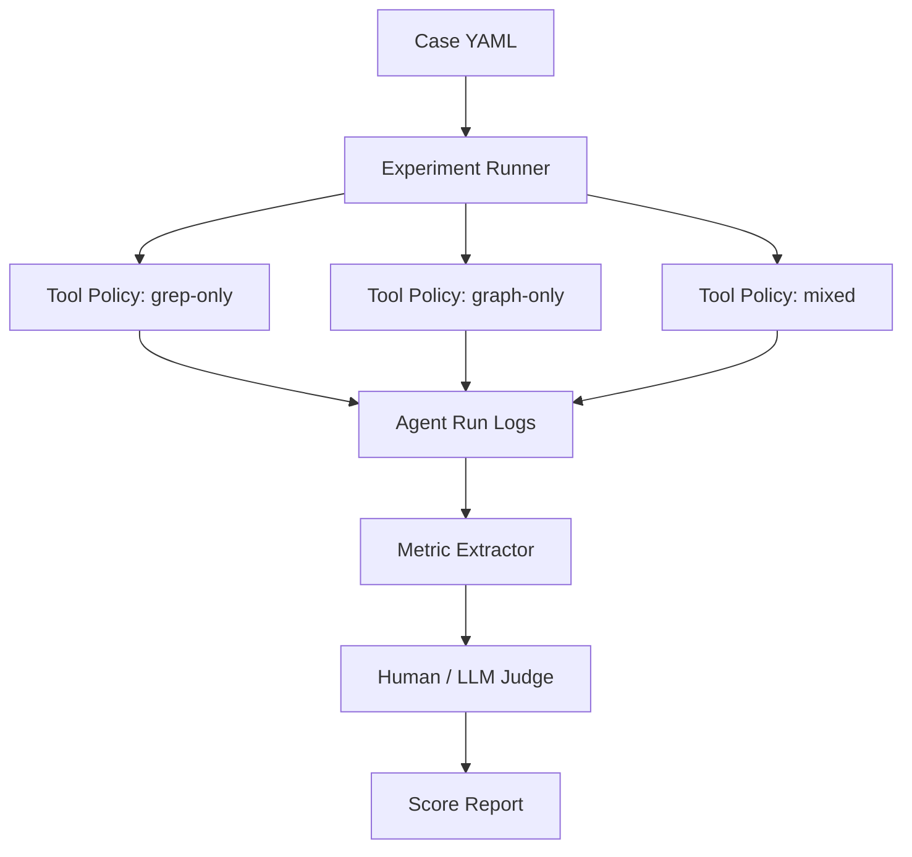

# AI Coding 场景下代码图谱 vs 传统字符检索 Case 设计

## 1. 目标与核心问题

本文档用于设计一组可执行、可量化的 AI Coding 对比实验，评估“传统字符检索”（grep / ripgrep / IDE 文本搜索）与“代码图谱”（GitNexus 的 `query` / `context` / `impact` / `detect_changes` 等结构化能力）在真实 AI Coding 工作流中的差异。

核心问题不是“图谱能不能搜到更多东西”，而是：

1. 在同一个代码任务下，图谱是否能降低模型理解代码的成本？
2. 图谱是否能减少 AI 修改代码时的遗漏和误判？
3. 图谱是否能把“靠模型猜测”变成“基于结构化证据推理”？
4. 在哪些场景下图谱收益很大，哪些场景下 grep 已经足够？
5. 如果要产品化验证这件事，需要怎样构造 case、采集数据、评估收益？

## 2. 实验变量隔离

实验设计的关键是隔离变量：

```text
同一个任务 Prompt
同一个代码库
同一个模型
同一套完成标准
唯一变化：底层检索能力
```

对比组：

| 组别 | 可用能力 | 禁用能力 | 目的 |
| --- | --- | --- | --- |
| 传统检索组 | `rg` / grep / 文件读取 / IDE 式文本搜索 | 图谱查询、调用图、影响分析 | 模拟普通 AI Coding 环境 |
| 图谱组 | GitNexus `query` / `context` / `impact` / `detect_changes` / 文件读取 | 纯粹靠大范围 grep 扫描 | 模拟结构化代码智能环境 |
| 混合组（可选） | 图谱 + grep | 无 | 验证现实最佳实践，而不是工具纯度 |

建议先做“传统检索组 vs 图谱组”的纯对比，再做“混合组”作为现实产品收益评估。纯对比能证明差异来源，混合组能证明真实使用价值。

## 3. 可行性判断

### 3.1 高可行场景

这些场景天然适合做 benchmark，因为 grep 与图谱的能力边界差异明显。

| 场景 | 可行性 | 原因 |
| --- | --- | --- |
| 函数签名修改 | 高 | 需要找调用方、实现方、测试、类型约束；图谱的 `impact` 很直接 |
| 接口 / 抽象类 / 多态调用 | 高 | grep 对动态分发和接口引用天然弱 |
| 跨模块调用链理解 | 高 | 图谱可按执行流组织上下文，grep 需要人工拼图 |
| 大量同名符号 | 高 | grep 噪音高，图谱可按符号身份区分 |
| 重构前影响分析 | 高 | 最终质量可用编译、测试、diff 范围验证 |
| 安全 / 数据流分析 | 中高 | 如果 PDG / taint 索引完整，图谱优势明显 |

### 3.2 中等可行场景

这些场景可以做，但需要控制实验设计，否则容易变成模型能力对比。

| 场景 | 风险 | 控制方式 |
| --- | --- | --- |
| bug 修复 | bug 定位常依赖模型推理，检索只是其中一环 | 选择“根因藏在调用链中”的 bug，而不是算法题 |
| 性能优化 | 需要运行时 profile，静态图谱不一定足够 | 将任务限定为“找热点路径和潜在重复调用” |
| API 行为理解 | 文档、测试、代码都影响答案 | 固定可读材料范围，记录工具调用路径 |
| 业务规则修改 | 模型对业务语义的理解影响很大 | 选择代码结构复杂但业务语义简单的规则 |

### 3.3 低可行场景

这些场景不适合作为第一批 case，因为图谱收益不稳定，容易被质疑。

| 场景 | 不适合原因 |
| --- | --- |
| 单文件小改动 | grep 足够快，图谱优势很小 |
| 明确字符串替换 | 文本搜索就是最优工具 |
| UI 文案修改 | 结构化调用关系价值低 |
| 纯算法函数内部优化 | 主要考模型推理，不考代码导航 |
| 依赖运行时状态的问题 | 静态图谱无法直接替代日志和调试器 |

## 4. Case 分层设计

建议把 case 分为 4 个层级，从低成本到高可信度逐步推进。

### L1：导航理解类

目标：评估 AI 找上下文的效率。

特点：

- 不要求修改代码。
- 只要求回答“调用链是什么”“谁依赖谁”“这个功能从入口到落库经过哪些步骤”。
- 成本低，适合快速验证图谱的上下文组织能力。

示例任务：

> 请分析 `/api/analyze` 从 HTTP 请求进入到数据库写入的完整调用链，并列出每一步的副作用。

主要指标：

- 是否找到正确入口。
- 调用链覆盖率。
- 工具调用次数。
- token 消耗。
- 是否出现编造的函数或路径。

### L2：影响分析类

目标：评估 AI 在改动前识别 blast radius 的能力。

特点：

- 可以不真正修改代码。
- 要求输出“如果修改 X，会影响哪些调用方、测试、流程和模块”。
- 非常适合体现 `impact` 的价值。

示例任务：

> 如果给 `ScopeResolver.resolveImportTarget` 增加一个可选的 `resolutionMode` 参数，需要同步检查哪些实现类、调用方和测试？

主要指标：

- 直接调用方覆盖率。
- 间接调用方覆盖率。
- 实现类覆盖率。
- 测试文件覆盖率。
- 风险分级是否合理。

### L3：小型真实修改类

目标：评估 AI 完成代码修改的正确性。

特点：

- 修改范围控制在 1 到 5 个文件。
- 可通过 typecheck 或 unit test 验证。
- 适合第一批端到端实验。

示例任务：

> 给某个配置项增加默认值，并确保 CLI、server、测试中的读取逻辑一致。

主要指标：

- 是否一次通过 typecheck。
- 是否通过目标测试。
- 是否遗漏调用点。
- diff 是否包含无关改动。
- 是否需要人工纠偏。

### L4：复杂重构类

目标：评估图谱在真实高风险 AI Coding 中的收益上限。

特点：

- 修改范围可能超过 10 个文件。
- 需要完整 impact、修改、detect_changes、测试验证。
- 成本高，但最接近产品价值。

示例任务：

> 重命名一个跨语言 ingestion pipeline 中的核心接口方法，并更新所有语言 provider、测试和文档。

主要指标：

- 编译通过率。
- 测试通过率。
- 漏改数量。
- 误改数量。
- 总耗时。
- 总 token。
- 人工 review 发现的问题数量。

## 5. 推荐的 Case 类型

### Case 1：同名符号噪音

设计目的：验证图谱按“符号身份”组织信息的优势。

构造方式：

- 选择一个通用函数名，如 `parse`、`resolve`、`analyze`、`process`、`run`。
- 代码库中存在多个模块使用同名函数。
- 任务要求只修改其中一个明确语义的函数。

传统检索组的困难：

- `rg "resolve"` 返回大量无关结果。
- 模型需要多轮过滤上下文。
- 容易把同名但不同模块的函数混在一起。

图谱组的优势：

- `context({name: "具体符号名"})` 可返回符号所在模块、调用方、被调用方、参与流程。
- 如果目标不唯一，图谱查询结果也能暴露候选符号，而不是只给文本行。

评分重点：

- 首轮定位是否准确。
- 是否误读同名函数。
- 检索噪音 token 占比。
- 修改是否落在正确模块。

### Case 2：接口、多态与间接调用

设计目的：验证 grep 对结构关系的盲区。

构造方式：

- 找一个接口或抽象 contract。
- 它有多个实现类。
- 调用方通过接口类型、工厂、registry 或 provider 分发。

传统检索组的困难：

- 能找到文本上出现的方法名。
- 但很难确认所有实现类、所有动态调用点、所有注册点。
- 如果方法名很常见，噪音更大。

图谱组的优势：

- `impact({target: "接口方法", direction: "upstream"})` 可暴露调用方和实现相关 blast radius。
- `context` 可补充 callees、callers、execution flows。

评分重点：

- 实现类覆盖率。
- 调用点覆盖率。
- 是否发现 registry / provider 注册点。
- 是否识别高风险调用链。

### Case 3：字段或数据结构变更

设计目的：验证多层传播和数据模型变更场景。

构造方式：

- 选择一个 DTO、schema、config 或 options 类型。
- 修改字段名、字段类型或新增必填字段。
- 要求同步 CLI、server、web、测试或持久化层。

传统检索组的困难：

- 字段名常见时噪音很高。
- 仅搜索字段名可能漏掉解构、映射、序列化、默认值、测试 fixture。
- 模型需要凭经验猜哪些层需要更新。

图谱组的优势：

- 结构化依赖能显示字段所在类型参与的函数和流程。
- `detect_changes` 可用于修改后确认影响面是否符合预期。

可行性前提：

- 该类 case 不能默认假设图谱一定能完整追踪字段级传播。实验前需要先做 sanity check，确认目标字段在索引中至少以类型、属性、引用或 PDG / 数据流边的形式可见。
- 如果目标字段主要出现在 JSON fixture、字符串 key、动态对象、序列化协议或外部 schema 中，应把该 case 降级为“中等可行”，并允许 grep 作为补充工具。
- 评分时要区分“图谱无法表达字段级关系”和“模型没有使用好图谱”这两种失败原因。

评分重点：

- 是否遗漏序列化 / 反序列化路径。
- 是否遗漏测试 fixture。
- 是否产生破坏性类型变化。
- 最终 typecheck 和测试结果。

### Case 4：执行流追踪

设计目的：验证图谱按 process / flow 组织上下文的优势。

构造方式：

- 选择一个用户可见入口，例如 CLI 命令、HTTP endpoint、MCP tool。
- 要求列出从入口到核心副作用的完整路径。

传统检索组的困难：

- 需要从路由、handler、service、repository、DB 写入一路手动追踪。
- 容易在 callback、factory、dependency injection 处断链。

图谱组的优势：

- `query({search_query: "功能描述"})` 可先定位流程。
- process / context 能直接返回按执行流组织的结果。

评分重点：

- 调用链完整性。
- 副作用识别准确率。
- 是否把无关路径混进来。
- 是否能指出关键风险点。

### Case 5：修改后范围校验

设计目的：验证 `detect_changes` 对 AI Coding 收尾阶段的价值。这个 case 应作为“改后验证能力”单独评估，不应混入“改前检索能力”的主对比，否则会污染实验变量。

构造方式：

- 让两组都完成同一个小改动。
- 修改后要求自查“是否只影响预期范围”。

传统检索组的困难：

- 通常只能靠 `git diff` 和模型阅读。
- 很难知道执行流是否被意外影响。

图谱组的优势：

- `detect_changes()` 或 `detect_changes({scope: "compare", base_ref: "main"})` 可检查受影响符号和执行流。
- 更适合作为提交前 gate。

实验拆分：

| 阶段 | 评估内容 | 传统检索组 | 图谱组 |
| --- | --- | --- | --- |
| A：改前上下文获取 | 找影响面、调用方、实现方、测试 | `rg` + 文件读取 | `impact` / `context` / `query` |
| B：代码修改 | 根据阶段 A 的上下文完成同一改动 | 允许编辑 + 测试 | 允许编辑 + 测试 |
| C：改后验证 | 判断 diff 是否只影响预期范围 | `git diff` + 人工/模型阅读 | `git diff` + `detect_changes` |

最终报告中应分别汇总 A 阶段和 C 阶段收益：A 阶段回答“图谱作为检索/理解工具有什么收益”，C 阶段回答“图谱作为提交前影响 gate 有什么收益”。

评分重点：

- 是否发现无关改动。
- 是否发现遗漏的调用点。
- 是否能解释影响范围。
- 是否给出合理回滚或补救建议。

## 6. GitNexus 代码库上的可执行 Pilot

### Pilot A：`ScopeResolver` 影响分析

任务 Prompt：

```text
请分析如果给 ScopeResolver.resolveImportTarget 增加一个可选的 resolutionMode 参数，
需要同步检查哪些实现类、调用方、测试和文档。
不要直接修改代码，先输出完整影响分析。
```

实验价值：

- `ScopeResolver` 属于 scope-resolution pipeline 的核心 contract。
- AGENTS.md 明确提到 shared ingestion code 不能直接写语言名，适合观察模型是否理解架构约束。
- 该场景同时包含接口、实现、调用方、测试和架构规则。

传统检索组可用路径：

```text
rg "resolveImportTarget"
rg "ScopeResolver"
rg "SCOPE_RESOLVERS"
```

图谱组可用路径：

```text
impact({target: "resolveImportTarget", direction: "upstream"})
context({name: "ScopeResolver"})
query({search_query: "scope resolution pipeline"})
```

预期差异：

- grep 能找到显式文本，但需要人工区分 contract、provider、fixture、文档。
- 图谱更容易组织出“contract -> implementations -> callers -> flows”的影响面。

验收标准：

- 至少列出 contract 文件、resolver 注册点、主要语言 resolver、核心调用方、相关测试。
- 至少识别 `scope-resolution/contract/scope-resolver.ts` 中的 `ScopeResolver.resolveImportTarget` 签名。
- 至少覆盖 TypeScript、JavaScript、Python、Java、C/C++ 等主要语言 resolver 中的 `resolveImportTarget` 实现或转发点。
- 明确指出 shared ingestion 代码不能硬编码语言名。
- 给出风险等级和建议验证命令。

### Pilot B：`/api/analyze` 执行流追踪

任务 Prompt：

```text
请分析 server 中 /api/analyze 端点从 HTTP 请求进入到实际 analyze 执行、
索引写入、错误返回的完整调用链。请标注每一步的副作用。
不要修改代码。
```

实验价值：

- 这是典型“入口到副作用”的理解任务。
- grep 很容易被 `analyze` 这个高频词污染。
- 图谱的 process / context 查询更贴近任务本身。

传统检索组可用路径：

```text
rg "/api/analyze"
rg "analyze"
rg "serve"
```

图谱组可用路径：

```text
query({search_query: "analyze API endpoint"})
context({name: "相关 handler"})
```

验收标准：

- 找到 HTTP route / handler。
- 找到 analyze 调用入口。
- 找到数据库或索引写入路径。
- 找到错误处理路径。
- 标注文件写入、数据库写入、进程启动等副作用。

### Pilot C：MCP tool 到核心逻辑追踪

任务 Prompt：

```text
请分析 GitNexus MCP 的 impact 工具从 MCP 请求进入到图查询执行的完整路径。
列出输入参数如何被解析、如何查询图谱、如何生成响应。
不要修改代码。
```

实验价值：

- 该 case 贴近 GitNexus 产品核心价值。
- 适合展示“用图谱分析图谱工具自身”的闭环。
- grep 组会遇到 `impact` 语义泛化和命名噪音。

验收标准：

- 找到 MCP server 注册位置。
- 找到 impact tool handler。
- 找到图查询或数据库查询逻辑。
- 找到响应组装逻辑。
- 说明错误处理和空结果行为。

### Pilot D：小型真实修改

任务 Prompt：

```text
请为 `gitnexus analyze --skip-skills` 增加一个等价别名 `--no-skills`。
要求同步更新 Commander 参数解析、帮助文案/i18n 文案和相关单元测试。
修改前先输出影响分析，修改后说明变更范围。
```

实验价值：

- 比纯分析更接近真实 AI Coding。
- 修改范围可控。
- 可以用 tests/typecheck 验证。

验收标准：

- 修改前有影响分析。
- 修改点至少覆盖 CLI option 定义、帮助文案或 i18n key、相关测试。
- 修改后通过目标测试；如测试名不确定，至少运行与 `analyze` CLI option 相关的单测或 `npx tsc --noEmit`。
- diff 不包含无关改动。
- 图谱组应使用 `detect_changes()` 做收尾校验。

可复现性约束：

- 固定目标 option 为 `--skip-skills`，不要让模型自行挑选“低风险 option”。
- 标准答案中应列出预期文件集合；如果实际代码中该 option 已经有别名，则该 case 应替换为另一个真实、低风险、无别名的 option。
- 修改类实验必须从 clean worktree 或独立临时分支开始，避免上一次 run 的 diff 污染下一次。

## 7. 指标体系

### 7.1 过程指标

| 指标 | 定义 | 采集方式 |
| --- | --- | --- |
| 工具调用次数 | 完成任务前调用检索/读取工具的次数 | 会话日志 |
| 检索轮次 | 产生新搜索关键词或新图谱查询的次数 | 会话日志 |
| 首次正确定位轮次 | 第几轮找到正确入口或目标符号 | 人工标注 |
| token 消耗 | 输入输出总 token 或近似文本量 | 平台统计 / 日志估算 |
| 无关上下文比例 | 检索结果中与任务无关的内容占比 | 抽样人工标注 |
| 人工纠偏次数 | 人需要提醒“找错了/漏了/方向错了”的次数 | 实验记录 |

### 7.2 结果指标

| 指标 | 定义 | 采集方式 |
| --- | --- | --- |
| 定位准确率 | 是否找到正确目标符号、入口或模块 | 标准答案对比 |
| 覆盖完整率 | 找到的相关调用点 / 标准调用点 | 标准答案对比 |
| 编译通过率 | 修改后 typecheck 是否通过 | `npx tsc --noEmit` |
| 测试通过率 | 目标测试是否通过 | `npm test` 或目标 test |
| 漏改数量 | 标准答案中应修改但未修改的位置 | review |
| 误改数量 | 不应修改但被修改的位置 | diff review |
| 解释可信度 | 是否能用真实代码路径支撑结论 | review rubric |

### 7.3 业务指标

| 指标 | 意义 |
| --- | --- |
| 平均完成时间下降 | 体现开发效率收益 |
| token 成本下降 | 体现 AI Coding 成本收益 |
| review 问题下降 | 体现质量收益 |
| 一次通过率提升 | 体现自动化修改可靠性 |
| 高风险改动可解释性提升 | 体现工程治理价值 |

## 8. 标准答案与裁判机制

为了避免“看起来合理但无法验证”，每个 case 都需要标准答案。

### 8.1 标准答案来源

推荐组合使用：

1. 人工专家阅读代码得到 ground truth。
2. GitNexus 图谱查询得到候选影响面。
3. `rg` 全量搜索补充文本层面的遗漏。
4. typecheck / tests 验证修改结果。
5. `git diff` / `detect_changes` 校验实际影响范围。

注意：不能只用图谱结果当标准答案，否则实验会偏向图谱。标准答案应该是“人工确认后的全集”。

### 8.2 裁判方式

建议每个 case 产出一份 JSON 或表格：

```json
{
  "case_id": "pilot-a-scope-resolver-impact",
  "expected_symbols": [],
  "expected_files": [],
  "expected_tests": [],
  "expected_risks": [],
  "must_mention_constraints": [],
  "validation_commands": []
}
```

裁判维度：

- 必须命中项：漏掉即扣大分。
- 加分项：能指出隐含风险、架构约束、测试策略。
- 扣分项：编造不存在路径、把无关模块列为核心影响、修改无关文件。

## 9. 实验执行方案

### 9.1 最小可行实验（1 周）

目标：快速证明有没有明显差异。

范围：

- 3 个 case：Pilot A、Pilot B、Pilot D。
- 每个 case 跑 2 组：传统检索组、图谱组。
- 每组跑 3 次，降低随机性。

运行隔离规则：

- 每次 run 必须使用 fresh context，不能把前一次运行的答案、标准答案或人工点评泄露给下一次。
- 修改类 case 每次必须从 clean worktree、独立临时分支或可重置 sandbox 开始。
- 固定模型、temperature、系统提示、工具权限和依赖版本。
- 记录工具违规：例如 grep 组调用图谱工具、图谱组大范围 `rg` 扫描。违规 run 应作废或单独标记。
- 每次 run 前记录 GitNexus 索引状态，包括索引时间、符号数、关系数、执行流数和当前 git commit。
- 输出阶段要区分“检索/理解阶段”和“修改/验证阶段”的指标，避免把 `detect_changes` 收益混入改前检索收益。

产出：

- 每个 case 的过程日志。
- 每次运行的评分表。
- 汇总对比图表。
- 结论：哪些维度差异最大。

### 9.2 中等规模实验（2 到 3 周）

目标：形成可对外说明的产品论证。

范围：

- 8 到 12 个 case。
- 覆盖 L1 到 L4。
- 加入混合组。
- 至少 2 个不同模型。

产出：

- 不同模型上的收益是否稳定。
- 图谱能力在哪些 case 中收益最大。
- grep 仍然足够的边界场景。
- 成本、耗时、正确性三类收益。

### 9.3 产品化评测集（长期）

目标：形成持续 regression benchmark。

范围：

- 每次 GitNexus 图谱能力升级后自动跑一批固定 case。
- 每个 case 有标准答案和评分脚本。
- 记录版本趋势。

产出：

- 图谱能力回归监控。
- 新功能收益量化。
- 面向用户的 demo case。

## 10. 实现方案

### 10.1 Case 定义格式

建议用 YAML 定义 case：

```yaml
id: pilot-a-scope-resolver-impact
name: ScopeResolver 影响分析
level: L2
task_type: impact_analysis
repo: GitNexus
prompt: |
  请分析如果给 ScopeResolver.resolveImportTarget 增加一个可选的 resolutionMode 参数，
  需要同步检查哪些实现类、调用方、测试和文档。
  不要直接修改代码，先输出完整影响分析。
allowed_tools:
  grep:
    - rg
    - read_file
  graph:
    - query
    - context
    - impact
expected:
  must_include_files:
    - gitnexus/src/core/ingestion/scope-resolution/contract/scope-resolver.ts
  must_mention:
    - ScopeResolver.resolveImportTarget
    - shared ingestion code must not hard-code language names
validation:
  commands: []
scoring:
  location_accuracy: 10
  coverage_completeness: 10
  token_efficiency: 10
  final_correctness: 10
```

### 10.2 Runner 架构



核心组件：

| 组件 | 职责 |
| --- | --- |
| Case Registry | 管理 case prompt、限制、标准答案、验证命令 |
| Tool Policy | 控制 agent 可用工具，隔离变量 |
| Runner | 多次执行同一 case，保存日志 |
| Metric Extractor | 统计工具调用、轮次、token、diff |
| Judge | 根据标准答案评分 |
| Report Generator | 输出 markdown / CSV / dashboard |

### 10.3 工具权限控制

传统检索组：

- 允许：`rg`、文件读取、测试命令。
- 禁止：GitNexus MCP `query` / `context` / `impact` / `detect_changes`。

图谱组：

- 允许：GitNexus MCP 工具、必要文件读取、测试命令。
- 限制：不允许用大范围 `rg` 扫描来替代图谱。
- 允许小范围读取图谱命中的文件。

混合组：

- 允许全部能力。
- 用于回答“真实用户会获得多少收益”。

### 10.4 日志采集

每次 run 至少保存：

```text
case_id
run_id
model
tool_policy
start_time
end_time
tool_calls
files_read
search_queries
graph_queries
final_answer
diff_summary
validation_results
human_notes
```

如果平台无法直接拿 token，可先用近似指标：

- 检索返回字符数。
- 被读取文件总字符数。
- final answer 字符数。
- 工具输出总字符数。

这些虽然不是精确 token，但足够支持初期趋势判断。

### 10.5 评分公式

建议先用简单加权：

```text
总分 = 0.25 * 定位准确率
     + 0.25 * 覆盖完整率
     + 0.20 * 最终正确性
     + 0.15 * token / 上下文效率
     + 0.15 * 过程稳定性
```

对于修改类 case，可提高最终正确性的权重：

```text
修改类总分 = 0.20 * 定位准确率
           + 0.20 * 覆盖完整率
           + 0.35 * 最终正确性
           + 0.10 * token / 上下文效率
           + 0.15 * diff 干净程度
```

## 11. 关键风险与规避

### 风险 1：模型自身太强，掩盖工具差异

表现：

- 简单 case 中模型不用太多检索也能猜对。

规避：

- 选择结构复杂、命名噪音高、调用链长的 case。
- 要求输出具体文件、函数、调用链和测试。
- 用覆盖率而不是“回答看起来对”评分。

### 风险 2：标准答案偏向图谱

表现：

- 用图谱输出作为唯一 ground truth，会天然利好图谱。

规避：

- 标准答案由人工 + grep + 图谱 + 测试共同确认。
- 对图谱漏掉但 grep 找到的文本引用也记录。

### 风险 3：图谱索引不完整

表现：

- 图谱结果漏边，导致图谱组表现异常差。

规避：

- 每次实验前记录索引版本、符号数、关系数、执行流数。
- 先用 sanity case 验证目标模块已被正确索引。
- 将“索引缺陷”作为单独分类，而不是混入 agent 失败。

### 风险 4：工具使用策略不公平

表现：

- 图谱组也大量 grep，或 grep 组偷偷获得结构化提示。

规避：

- 在 system / tool policy 层控制工具。
- 日志中标记违规调用。
- 违规 run 作废。

### 风险 5：任务太偏实现细节

表现：

- case 变成“谁更会写代码”，而不是“谁更会获得上下文”。

规避：

- 第一阶段优先 L1 / L2。
- 修改类 case 控制 diff 范围。
- 单独记录“上下文获取阶段”和“代码修改阶段”。

## 12. 收益解释框架

最终报告不要只说“图谱更好”，而要分场景解释收益：

| 场景 | 图谱收益 | 解释 |
| --- | --- | --- |
| 单文件、明确字符串 | 低 | grep 已经足够 |
| 同名符号多 | 中高 | 图谱减少噪音 |
| 接口、多态、registry | 高 | 图谱能表达结构关系 |
| 跨模块执行流 | 高 | 图谱能按流程组织上下文 |
| 大型重构 | 很高 | 图谱可降低遗漏和误改 |
| 运行时状态问题 | 中低 | 仍需日志、测试、调试器 |

可以用一句话总结：

> 传统检索解决“这个字符串在哪里出现”，代码图谱解决“这个符号、调用、数据和流程如何相互影响”。AI Coding 的关键瓶颈不是找不到文本，而是无法稳定获得正确、完整、低噪音的上下文。

## 13. 建议落地路线

### 第一步：先做 3 个 Pilot

优先级：

1. Pilot A：`ScopeResolver` 影响分析。
2. Pilot B：`/api/analyze` 执行流追踪。
3. Pilot D：小型真实修改。

目标：

- 快速验证差异是否明显。
- 建立评分表和日志格式。
- 找出 GitNexus 图谱当前的短板。

### 第二步：扩展成 10 个 Case

覆盖：

- 2 个同名符号 case。
- 2 个接口 / 多态 case。
- 2 个执行流 case。
- 2 个数据结构变更 case。
- 2 个真实修改 case。

目标：

- 形成稳定 benchmark。
- 能对外说明“哪些任务收益最大”。

### 第三步：产品化为 Demo + Regression

Demo 侧：

- 展示同一个任务下 grep 组如何多轮搜索、图谱组如何一次 impact/context 命中。
- 展示 token 和遗漏率差异。

Regression 侧：

- 每次图谱能力升级后跑固定 case。
- 观察覆盖率、执行流命中率、评分变化。

## 14. 初步预期

在 GitNexus 这类中大型 TypeScript 代码库上，预期结果大致如下：

| 指标 | 传统检索组 | 图谱组 | 预期收益 |
| --- | --- | --- | --- |
| 导航理解轮次 | 5 到 12 轮 | 2 到 5 轮 | 减少 40% 到 70% |
| 检索输出字符量 | 高 | 中低 | 减少 50% 到 85% |
| 调用点覆盖率 | 中等，依赖任务 | 较高 | 提升 20% 到 60% |
| 同名符号误判 | 较高 | 较低 | 明显下降 |
| 修改类一次通过率 | 中等 | 中高 | 取决于索引完整度 |
| review 发现遗漏 | 较多 | 较少 | 对复杂 case 更明显 |

这些数字不是最终结论，只是 pilot 前的假设。实验价值就在于把这些假设转成可审计的数据。

## 15. 下一步行动清单

已落地的初版规格文件：

- `docs/benchmark/gitnexus/cases/pilot-a-scope-resolver-impact.yaml`
- `docs/benchmark/gitnexus/cases/pilot-b-analyze-api-flow.yaml`
- `docs/benchmark/gitnexus/cases/pilot-d-skip-skills-alias.yaml`
- `docs/benchmark/shared/scoring-rubric.md`

后续建议：

1. 人工审定 Pilot A / B / D 的 ground truth，把 `draft-ground-truth` 状态改为 `ready`。
2. 手动跑一轮传统检索组和图谱组，确认 case 难度合适。
3. 根据首轮日志修订 `scoring-rubric.md`，让评分口径更稳定。
4. 再做多次运行，统计平均值和方差。
5. 根据结果决定是否扩展到 10 个 case。
