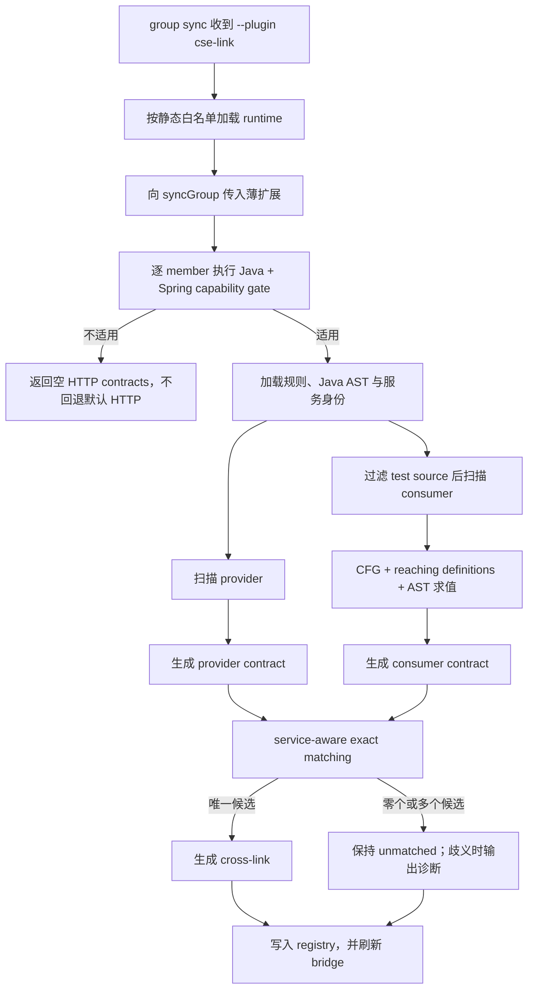

# CSE Link 内置可选插件：现行设计与遗留问题

> 状态：已实现，存在阻断生产启用的 P1 遗留问题
>
> 插件 ID：`cse-link`
>
> 插件版本：`0.1.0`
>
> 适用分支：基于 GitNexus 1.6.8 的 CSE-link 定制分支
>
> 实现基线：`bc1221bb` 后的最小基线改造工作区
>
> 最后更新：2026-07-24

## 1. 文档定位

本文是 CSE-link 的现行设计、实现边界和验收基线，取代此前分别描述
RestTemplate 定制和内置插件方案的两份历史设计稿。

当前实现已经从“在默认 HTTP extractor 中嵌入 CSE 特判”演进为
**内置、可选、默认关闭的 Group Contract 插件**。最新一轮又将方法内字符串值分析
从手写控制流规则改为：

```text
Tree-sitter Java AST
  → GitNexus Java CFG 与 binding
  → reaching definitions
  → 插件内 DefinitionCatalog
  → AST 字符串表达式求值
  → Known / Unknown
```

本文以当前代码和实际生成的 `contracts.json` 为准。目标是让维护者明确：

- 哪些能力已经实现；
- 哪些语法是有意不支持；
- 插件与 GitNexus 基线代码的边界；
- 哪些已复现问题仍需修复，不能被测试通过或样例产物掩盖。

## 2. 目标与原则

### 2.1 功能目标

CSE-link 面向 Java Spring 微服务 group，提取：

- Spring MVC Controller 暴露的 HTTP provider；
- `RestTemplate` 通过 `cse://<serviceRef>/...` 发起的 HTTP consumer；
- consumer 与唯一目标微服务 provider 之间的 cross-link。

关联的核心键为：

```text
serviceRef / serviceName
  + HTTP method
  + normalized full route
```

其中 provider route 必须包含 Controller 类级 `@RequestMapping` 前缀。

### 2.2 保守解析

静态分析只在结果唯一且可证明时输出 contract：

- 唯一静态字符串结果记为 `Known(value)`；
- 动态值、循环依赖、不支持语法或控制流分歧记为 `Unknown`；
- `Unknown` 不生成 consumer 或不完整 provider；
- 多个 provider 候选不任选、不扇出。

这里优先避免误关联，允许漏报，不允许通过猜测制造高置信度 cross-link。

### 2.3 最小化基线修改

CSE 领域实现集中在：

```text
gitnexus/src/plugins/builtins/cse-link/
```

基线只保留通用能力：

- CLI 的单次 `--plugin <id>` 选择；
- 静态内置插件白名单；
- `syncGroup` 中 HTTP extractor、exact matcher 和失败策略三个薄扩展点。

以下能力全部留在插件目录，不修改 Group 基线语义：

- Java + Spring 能力检测；
- CSE contract 实例身份；
- `serviceRef/serviceName` exact matching 与歧义诊断；
- 插件诊断、指标和独立国际化。

`group.yaml`、MCP、`ContractRegistry` schema、默认 matching 和默认 extractor
均不感知 CSE-link。未传 `--plugin` 时执行路径与 GitNexus 1.6.8 基线一致。

插件只通过 `java-analysis/cfg-adapter.ts` 只读复用核心 Java CFG 与
reaching-definitions 实现。核心 ingestion 不感知 CSE、`cse://`、
`RestTemplateBuilder` 或 `service_description.name`。

## 3. 适用范围

### 3.1 支持范围

```text
语言：Java
服务端：Spring MVC / Spring Boot Web
consumer：Spring RestTemplate
可信创建方式：RestTemplateBuilder.create()
服务寻址：cse://<serviceRef>/...
provider：Spring mapping annotation
```

仓库必须同时满足：

1. 至少存在一个 `.java` 文件；
2. build 文件、Java import 或 annotation 中存在 Spring Web 证据。

仓库名或目录名中包含 `spring`、`cse` 不构成能力证据。

### 3.2 非目标

当前版本不支持：

- Kotlin Spring；
- Spring WebFlux `WebClient`；
- OpenFeign、原生 Feign、OkHttp、Apache HttpClient；
- JAX-RS client；
- 普通 `http://`、`https://` RestTemplate 调用；
- 任意自定义 RestTemplate wrapper；
- 动态反射或运行时字符串计算；
- 为 CSE 调用生成 ingestion `FETCHES`；
- 外部 npm 插件或任意本地路径动态加载；
- 修改 LadybugDB schema 或 bridge schema。

启用 CSE-link 时，默认 HTTP extractor 被整个 group 替换。非 Java/Spring member
不会回退到默认 HTTP 提取，这是 CSE-only group 的有意行为。

## 4. 启用方式

### 4.1 CLI

本次同步显式启用：

```bash
gitnexus group sync cse-services --plugin cse-link
```

不传参数即执行默认 Group 同步：

```bash
gitnexus group sync cse-services
```

当前只允许选择一个内置插件。没有 `--no-plugins`、持久化配置或选择优先级；
参数只影响本次 CLI 调用，也不会向 `contracts.json` 增加 generation 元数据。

### 4.2 暂不支持的入口

- `group.yaml.plugins`；
- MCP `group_sync.plugins/noPlugins`；
- 多插件组合和 extractor replacement 冲突处理。

### 4.3 与 HTTP detect 开关的关系

CSE-link 的 extractor 类型仍为 `http`，因此 `group.yaml` 中
`detect.http` 必须启用。插件被选中但 `detect.http: false` 时不会执行提取。

### 4.4 Consumer 来源决策

当前版本没有 `graph/source consumer` 二选一参数。

CSE consumer 的权威来源固定为 Java 源码扫描，原因是当前 ingestion 不会为
RestTemplate `cse://` 调用生成可供 Graph consumer 使用的 `FETCHES`。Graph
可以用于其他 GitNexus HTTP 场景，但不能凭空发现 CSE consumer。

如果未来要在通用 `group sync` 中加入 consumer 来源选择，应作为独立的基线能力设计，
不能改变 CSE-link 当前的源码权威语义。

## 5. 插件结构

```text
gitnexus/src/plugins/
├── plugin-api.ts                    # 插件运行时、诊断与指标
├── plugin-registry.ts               # 静态内置白名单
└── builtins/cse-link/
├── index.ts                         # runtime 与 sync 扩展组装
├── matching.ts                      # CSE-only service-aware matching
├── capability.ts                    # Java + Spring 能力门禁
├── cse-link-extractor.ts            # repo 级编排、contract、诊断、指标
├── java-scanner.ts                  # provider / consumer AST 扫描
├── java-constant-resolver.ts        # 对 scanner 暴露的值解析 facade
├── cse-url.ts                       # cse URL 与 route 归一化
├── rules.ts                         # microservice-rules.yaml
├── test-source-filter.ts            # 测试 source-set 过滤
├── synthetic-uid.ts                 # 稳定 symbol UID
├── i18n/
│   ├── index.ts
│   ├── en.ts
│   └── zh-CN.ts
└── java-analysis/
    ├── ast-utils.ts
    ├── cfg-adapter.ts
    ├── class-constant-index.ts
    ├── definition-catalog.ts
    ├── model.ts
    ├── reaching-value-resolver.ts
    └── string-expression-evaluator.ts
```

国际化资源由插件独立持有，使用 `cse-link` namespace；插件 key 不进入核心
`CliMessageKey`。

## 6. 端到端流程



插件 manifest：

```ts
{
  id: 'cse-link',
  version: '0.1.0',
  createRuntime() {
    return {
      extension: {
        httpExtractor,
        runExactMatch: cseExactMatcher,
        abortOnRepoError: true
      }
    };
  }
}
```

## 7. Provider 提取

### 7.1 服务身份

provider 的 `serviceName` 来自仓库内以下配置：

- `src/main/resources/application.{yaml,yml,properties}`；
- `src/main/resources/bootstrap.{yaml,yml,properties}`；
- 多模块中匹配的 `application` / `bootstrap` 资源文件；
- 兼容 `code/webapp/src/main/resources` 布局。

识别键：

```yaml
service_description:
  name: order-service
```

或：

```properties
service_description.name=order-service
```

规则：

- 只有一个非空候选时使用；
- 没有候选时输出 `MISSING_SERVICE_NAME`；
- 多个不同候选时输出 `AMBIGUOUS_SERVICE_NAME`；
- 缺失或歧义时不生成该 repo 的 provider，但 consumer 仍可生成。

### 7.2 Controller route

支持的方法级 annotation：

- `@GetMapping`
- `@PostMapping`
- `@PutMapping`
- `@DeleteMapping`
- `@PatchMapping`
- 带单一静态 `method = RequestMethod.X` 的 `@RequestMapping`

支持 `value`、`path` 和位置参数中的单一静态路径。类级
`@RequestMapping` 与方法级路径通过 `joinRoutePath()` 拼接，再统一归一化。

示例：

```java
@RestController
@RequestMapping("/rest/v1")
class OrderController {
    @GetMapping("/orders/{id}")
    Order get(String id) { ... }
}
```

生成：

```text
serviceName = order-service
contractId  = http::GET::/rest/v1/orders/{param}
```

类级 mapping 存在但不能静态解析时，整个类不输出短路径 provider，防止漏掉 prefix
后误关联。多值路径数组、无静态值 mapping 和自定义 composed annotation 当前不展开。

## 8. Consumer 提取

### 8.1 可信 receiver

仅识别：

```java
RestTemplateBuilder.create().getForObject(url, Type.class);
```

以及可识别的别名：

```java
RestTemplate rt = RestTemplateBuilder.create();
rt.getForObject(url, Type.class);
```

普通同名对象、未知工厂返回值和任意 wrapper 不应被当作可信 receiver。

### 8.2 方法映射

| RestTemplate 方法 | HTTP method |
|---|---|
| `getForObject` / `getForEntity` | `GET` |
| `postForObject` / `postForEntity` | `POST` |
| `put` | `PUT` |
| `delete` | `DELETE` |
| `patchForObject` | `PATCH` |
| `exchange(url, HttpMethod.X, ...)` | `X` |

`exchange` 只接受可静态识别的 `GET`、`POST`、`PUT`、`DELETE`、`PATCH`。
URL 必须位于第一个参数。

### 8.3 CSE URL

支持：

```text
cse://<serviceRef>/<path>
cse://<appId>:<serviceRef>/<path>
```

解析结果：

- `serviceRef`：用于 provider 服务过滤；
- `appId`：保留在 contract meta，不代替 `serviceRef`；
- `pathTemplate`：参与 contract ID；
- `queryTemplate`：保留在 meta，不参与 route matching；
- query 参数名：可被解析但不参与 cross-link 选择。

`%s`、`{name}`、`:name` 路径段统一为 `{param}`。query 和 fragment 不进入
contract ID。authority 包含动态占位符、非法标识或端口式后缀时返回 Unknown。

### 8.4 测试源码过滤

consumer 扫描前过滤：

- 任意深度的 `src/test/`；
- 任意深度的 `src/integrationTest/`；
- 任意深度的 `src/functionalTest/`；
- 仓库根目录的 `test/`、`tests/`；
- `.gitnexus/microservice-rules.yaml` 中配置的额外 source root。

因此测试目录下的 `*Test.java` 不生成 consumer，也不参与 cross-link。

过滤依据是 source-set 路径，不是类名。生产源码中的
`src/main/java/.../OrderClientTest.java` 不会仅因类名后缀被过滤；这可避免把生产中
合法但命名特殊的类误删。

## 9. Java 静态值分析

### 9.1 分层职责

方法内 consumer URL 的解析流程：

1. `java-scanner.ts` 找到调用及其 enclosing method；
2. `cfg-adapter.ts` 用核心 `createJavaCfgVisitor()` 构建方法 CFG；
3. 核心 `computeReachingDefs()` 计算 binding 的 def-use；
4. `definition-catalog.ts` 收集变量声明和 assignment 的 AST RHS；
5. `reaching-value-resolver.ts` 将到达调用点的定义映射回 RHS；
6. `string-expression-evaluator.ts` 递归求值；
7. 所有可达定义结果完全一致时返回 `Known`，否则返回 `Unknown`。

核心 CFG 复用边界集中在 adapter，其他插件文件不依赖 CFG 内部结构。

### 9.2 支持的表达式

- Java string literal；
- `+` 字符串拼接；
- 括号表达式；
- 方法局部变量声明和重赋值；
- `+=` 字符串追加；
- `URI.create(expr)`；
- 当前文件 `final String` 字段；
- 仓库内跨类 `final String` 字段；
- 显式 import、FQCN 和唯一 simple name；
- 规则文件提供的外部常量。

### 9.3 控制流与作用域

当前设计要求：

- 局部变量在有效作用域内覆盖同名类字段；
- if/else 多条可达定义相同才是 Known；
- 多条可达定义不同则是 Unknown；
- 重赋值后，同函数内后续引用读取最新到达定义；
- 同一方法内多次调用按真实调用点求值；
- 重载方法通过 method declaration 起始行区分；
- 循环、try/catch 等控制流由核心 CFG 表达，不再由插件手写 walker 推断。

已补充的回归覆盖包括：

- 二元表达式 RHS 中局部变量覆盖类字段；
- 同一行声明后调用；
- 同一行声明、重赋值、调用；
- 同一行两个调用读取不同 URL；
- 显式 import 优先于其他同 simple name 类；
- 调换文件扫描顺序不改变结果；
- simple name 歧义时不输出 consumer。

### 9.4 类常量

常量索引以 file、class simple name 和 FQCN 组织。仅索引带 initializer 的
`final String` 字段；动态字段和 Unknown initializer 不进入索引。

跨类解析优先级：

```text
精确 FQCN
  > 显式 import
  > 当前 package + simple name
  > 唯一 simple name
  > 配置的 external constant
  > Unknown
```

注意：嵌套类的 enclosing-class 精确解析仍有 P1 遗留问题，见第 14 节。

## 10. Contract 与匹配

### 10.1 Contract

统一使用：

```text
http::<METHOD>::<NORMALIZED_PATH>
```

consumer meta 至少包含：

```json
{
  "sourcePlugin": "cse-link",
  "framework": "spring-rest-template-cse",
  "extractionStrategy": "source_authoritative",
  "method": "GET",
  "path": "/rest/v1/orders/{param}",
  "serviceRef": "order-service",
  "matchPolicy": "service-exact"
}
```

provider meta 至少包含：

```json
{
  "sourcePlugin": "cse-link",
  "framework": "spring-cse",
  "method": "GET",
  "path": "/rest/v1/orders/{param}",
  "serviceName": "order-service"
}
```

真实 graph symbol 无法复用时，插件根据源码锚点、角色、方法、路径和服务身份生成稳定
synthetic UID。

### 10.2 实例身份

不能只用 `contractId` 判断同一条 contract。通用 `contractInstanceKey()` 包含：

```text
repo
role
normalized contractId
symbolUid
serviceRef / serviceName
```

这样同名 API、同路径的不同服务、同 repo 的不同 symbol 不会在 matched/unmatched
或去重阶段被错误折叠。

### 10.3 Exact matching

对携带 `serviceRef` 的 consumer：

1. 按 method + normalized path 查 provider；
2. 要求 provider `serviceName === consumer.serviceRef`，大小写敏感；
3. 同 repo 且 service boundary 缺失或相同时排除自关联；同 repo 的不同
   monorepo service boundary 可以关联；
4. 按 contract 实例身份去重；
5. 恰好一个候选时生成 cross-link；
6. 多个不同 provider 实例仍然存在时不生成 link，记录
   `AMBIGUOUS_PROVIDER_MATCH`。

consumer 没有 `serviceRef` 时保留基线 HTTP 的扇出语义；CSE consumer 正常情况下
总是携带 `serviceRef`。

## 11. 规则文件

仓库可选配置：

```text
.gitnexus/microservice-rules.yaml
```

示例：

```yaml
version: 1

externalConstants:
  - className: com.acme.SharedRoutes
    constants:
      ORDER_URL: cse://order-service/rest/v1/orders

testSourceRoots:
  - src/componentTest
```

兼容旧布局：

```yaml
version: 1

javaHttpClients:
  - externalConstants:
      - className: com.acme.SharedRoutes
        constants:
          ORDER_URL: cse://order-service/rest/v1/orders
```

安全与资源限制：

- 最多 100 个外部常量类；
- 每个类最多 100 个常量；
- 最多 20 个额外测试 source root；
- 字符串最大 4096；
- test source root 必须是仓库相对路径，拒绝绝对路径和 `..`；
- 规则版本高于 1、YAML 非法或字段类型错误时，该 repo 提取失败并报告
  `RULES_INVALID`。

## 12. 失败、诊断与可观测性

主要诊断 code：

- `RULES_INVALID`
- `MISSING_SERVICE_NAME`
- `AMBIGUOUS_SERVICE_NAME`
- `FILE_PARSE_FAILED`
- `RESOURCE_LIMIT_EXCEEDED`
- `PLUGIN_EXTRACTION_FAILED`
- `AMBIGUOUS_PROVIDER_MATCH`

单 repo 最多直接报告 200 条插件诊断，超出部分聚合。插件报告：

- `files_scanned`
- `files_skipped`
- `providers_detected`
- `consumers_detected`
- `duration_ms`

能力检测返回 `false` 时，该 member 不产生 CSE HTTP contract。能力检测或 extractor
抛出异常时，`abortOnRepoError` 使本次同步在写 registry 之前失败，因此不会用部分结果
替换上一份有效 registry。诊断与指标由 CLI 持有的插件 runtime 输出，不进入核心
`SyncResult` 或 `ContractRegistry` schema。

## 13. 当前验证基线

基于最小基线改造工作区：

```bash
cd gitnexus
npx vitest run test/unit/group/plugins test/unit/group/sync.test.ts \
  test/unit/group/matching.test.ts test/unit/group/config-parser.test.ts \
  test/integration/group/group-cli.test.ts
npx tsc --noEmit
```

结果：

- 定向回归：12 个文件、209 个测试通过；
- TypeScript 类型检查通过；
- 完整 `npm test` 结果见本次实现最终验证记录；
- `git diff --check` 通过。

手工 group `cse-link-p1-fix` 的产物：

```text
generatedAt: 2026-07-24T07:57:36.360Z
repos: provider, consumer1, consumer2
contracts: 33
crossLinks: 8
consumer1 -> provider: 5
consumer2 -> provider: 3
```

抽样结论：

- contract / cross-link 的 service、route、role 未发现不一致；
- 测试 source-set 未产生 contract；
- consumer1 的歧义调用 `getAmbiguous` 没有 link；
- consumer2 的唯一调用 `callAmbiguous` 产生一个 link；
- `searchOrders` 保留 query template
  `status={status}&region={region}`；
- 该产物与修复前基线在 contract/cross-link 语义上保持一致。

这份产物证明主样例没有回归，但不能覆盖第 14 节的反例。

## 14. 遗留问题

### 14.1 P1：嵌套类 provider 常量缺少 enclosing-class 上下文

**状态：已复现，未修复。**

当前 provider 调用 `resolveExpression()` 时不传 enclosing class。类级 bare identifier
解析会先在整个文件搜索，之后还会落到跨类 flat map。

反例：

```java
class Container {
    @RestController
    @RequestMapping(PREFIX)
    static class A {
        static final String PREFIX = "/a";

        @GetMapping("/x")
        Object getA() { return null; }
    }

    @RestController
    @RequestMapping(PREFIX)
    static class B {
        static final String PREFIX = "/b";

        @GetMapping("/x")
        Object getB() { return null; }
    }
}
```

期望 provider：

```text
getA -> /a/x
getB -> /b/x
```

当前可将两者都解析为 `/b/x`，造成 provider 路径污染和后续误关联。

修复要求：

- scanner 将真实 enclosing class AST node 或稳定 class identity 传给 resolver；
- 常量索引使用包含嵌套层级的 class identity，而不是文件级 flat map；
- bare identifier 只在当前类及合法 Java 外层作用域解析；
- 无法唯一确定时返回 Unknown，禁止按遍历顺序选择；
- 增加同文件嵌套 Controller、同名常量、交换声明顺序的回归测试。

### 14.2 P1：definition 映射丢失 CFG block identity

**状态：已复现，未修复。**

reaching-def 的定义点本来包含：

```text
blockIndex + stmtIndex + line
```

但 `evaluateDefSiteRhs()` 只接收 `line + stmtIndex`。当不同 CFG block 的定义位于同一
源码行时，`disambiguateDefSite()` 退化为 column/顺序启发式，并可能选择错误 RHS。

反例：

```java
void test(boolean flag) {
    String url = "cse://svc/a"; while (flag) url = "cse://svc/b"; rt.getForObject(url, X.class);
}
```

当前可能输出 `/a` consumer；运行时也可能到达 `/b`，正确结果应为 Unknown、不输出
consumer。当前行为属于误关联风险，而不是普通漏报。

修复要求：

- DefinitionCatalog 和 resolver 全程携带完整 `ProgramPoint`；
- AST def site 与 CFG statement 建立精确 source range 映射；
- 禁止使用“第一个、最后一个、列顺序”作为歧义兜底；
- 无唯一映射时返回 Unknown；
- 增加同一行跨 loop/if block 定义的反例。

### 14.3 P1：同一行 `+=` 错删有效前序定义

**状态：已复现，未修复。**

`findBindingValueAtLine()` 为排除 `+=` 自身定义，当前使用：

```ts
d.def.line !== atLine
```

这会把同一行中早于 `+=` 的合法定义一起删掉。

反例：

```java
String url = "cse://svc"; url += "/x"; rt.getForObject(url, X.class);
```

期望输出 `/x` consumer，当前结果为空，属于稳定漏报。

修复要求：

- 只按完整 program point 排除当前 compound-assignment 的 self definition；
- 同一行内按 CFG program point 或精确 AST range 排序；
- 不得用行号代替语句身份；
- 增加同一行声明、`+=`、调用以及多个 `+=` 的回归测试。

### 14.4 P2：AST-only 边界仍有历史文本求值代码

`string-expression-evaluator.ts` 仍导出 `evaluateTextExpression()` 和
`splitConcatSafe()`，`java-constant-resolver.ts` 仍保留相关 import。主 consumer
流程已经使用 AST 求值，这段文本 fallback 会让未来维护者误用并重新引入
“字符串内容被当成操作符”的问题。

建议：

- 删除未使用的文本求值入口和 import；
- provider 也只接收 AST node；
- 增加静态检查或单测，阻止 consumer 回退到 text splitting。

### 14.5 P2：MethodAnalysis 与 DefinitionCatalog 缓存未统一

方法 CFG/reaching-definitions 使用 `MethodAnalysisCache`，但
`getOrBuildCatalog()` 当前每次重建 DefinitionCatalog。不会改变结果，但会放大包含
大量 RestTemplate 调用的方法的扫描成本。

建议将 method analysis 与 catalog 合并为同一方法级缓存记录，并保留单文件生命周期，
避免跨 repo 泄漏。

### 14.6 P2：RestTemplate alias 收集仍为文件级正则

`collectRestTemplateAliases()` 通过注释清理后的文件文本正则收集别名，集合对整个文件
生效，没有绑定到声明所在 class、method 和作用域。若另一个作用域出现同名未知对象，
存在被错误视为可信 receiver 的可能。

建议后续复用 AST binding/CFG：

- 将 receiver 声明和使用绑定到同一 symbol；
- 支持重赋值失效；
- 同名参数、局部变量、字段和不同方法之间不共享信任；
- 增加跨方法同名 receiver 的负向测试。

### 14.7 P2：Provider 识别以 mapping 为主，未强制 stereotype

当前 scanner 查找 class 中的 Spring mapping，但没有强制 class 同时带
`@RestController` 或 `@Controller`。在使用 mapping annotation 但并非实际
Controller bean 的 class 中，可能生成多余 provider。

建议明确产品语义后选择一种方式：

- 严格模式：要求 Controller stereotype 或可证明的 meta-annotation；
- 兼容模式：保留 mapping-only，但降低 confidence 并输出来源诊断。

在决定前，需要增加“非 bean class 带 mapping”的负向 fixture。

## 15. 完成标准

当前插件架构和主流程已经完成，但达到生产可启用状态至少还需要：

- 修复第 14.1、14.2、14.3 节全部 P1；
- 每个 P1 同时增加正向、负向和声明顺序无关测试；
- 重新生成真实 group 产物并人工抽样同名 API、Controller prefix、test source-set；
- 运行 CSE-link 定向测试、matching/group sync 相关测试和 `npx tsc --noEmit`；
- 在环境允许时完成 `npm test`，不能把超时记为通过；
- 运行 GitNexus `detect_changes()`，确认 P1 修复仍局限于插件目录和预期测试；
- 修复后更新本文的实现基线、验证结果和遗留问题状态。

P2 可以作为明确技术债保留，但任何会制造错误 cross-link 的问题都应提升为 P1，
不得仅以“样例产物正确”作为关闭依据。
